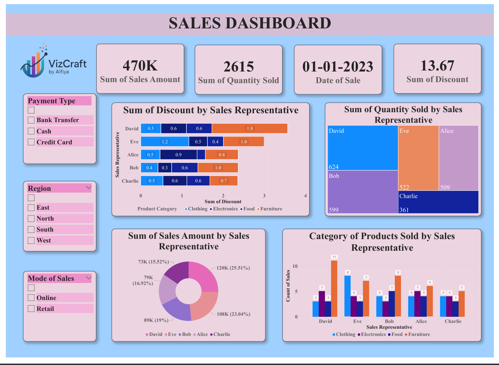

# 📊 Power BI Sales Dashboard

This project is a **Power BI Dashboard** created to analyze and visualize sales data.  
It provides insights into revenue trends, customer distribution, and product performance using interactive visuals.  

---

## 📂 Project Structure

PowerBI-Sales-Dashboard/

│── First Power BI Dashboard.pbix            # Main Power BI dashboard file  
│── First Power BI Dashboard.pdf             # Exported PDF (for quick preview)  
│── dashboard_preview.png                    # Screenshot of the dashboard  
│── README.md                                # Documentation  

---

## 📊 Features

- 📈 Sales performance overview  
- 🌍 Revenue by region and category  
- 📅 Monthly and quarterly sales trends  
- 🏆 Top-performing products and customers  
- 🔍 Interactive filters and slicers for deeper insights  

---

## ⚙️ Requirements

- **Microsoft Power BI Desktop** (to open `.pbix` file)  
- **Any PDF viewer** (to view the `.pdf` version)  

---

## ▶️ How to Run

git clone https://github.com/<your-username>/PowerBI-Sales-Dashboard.git  
cd PowerBI-Sales-Dashboard  

1. Open `First Power BI Dashboard.pbix` in **Power BI Desktop**.  
2. For a quick look, open the exported `First Power BI Dashboard.pdf`.  

---

## 📌 Insights

- Identify revenue trends and seasonal patterns  
- Analyze customer distribution and regional performance  
- Track top-performing products and customers  
- Support data-driven decision making for sales strategies  

---

## 📸 Dashboard Preview

  

---

## 🛠️ Skills Demonstrated

- **Power BI** → Data visualization and dashboarding  
- **Data Storytelling** → Turning raw data into actionable insights  
- **Business Analytics** → Sales trends, KPIs, and customer analysis  
- **Interactive Reporting** → Slicers, filters, and dynamic views  

---

## 📜 License

This project is licensed under the **MIT License**  
